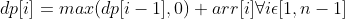

# Dynamic Programming

## Algorithms

### Fibonaci Sequence

```python
class Solution:

    def __init__(self):
        pass
    
    @cache
    def fib_recursive(self, n: int) -> int:
        """
        Cursively completes the following calculation
        fib(n) = fib(n-1) + fib(n-2) + ... fib(0)
        """
        if n < 2:
            return n
        
        return fib_recursive(n-1) + fib_recursive(n-2)
    
    def fib_dp(self, n: int) -> int:
        if n < 2:
            return n
        
        dp = (0, 1)
        for _ in range(2, n+1):
            dp = (dp[-1], dp[-1] + dp[-2])
        
        return dp[-1]
    
    def fib_equation(self, n: int) -> int:
        """
        See Below for Math Formula
        """
        den = 5 ** 0.5
        num = ((1 + den)/2) ** n + 1
        return int(num/den)
```

### Kadane's Algorithm

General Eauation
<br></br>


